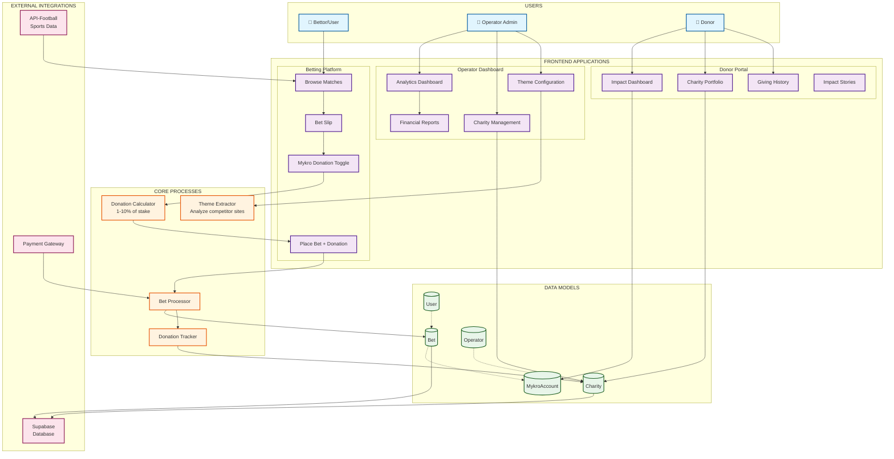
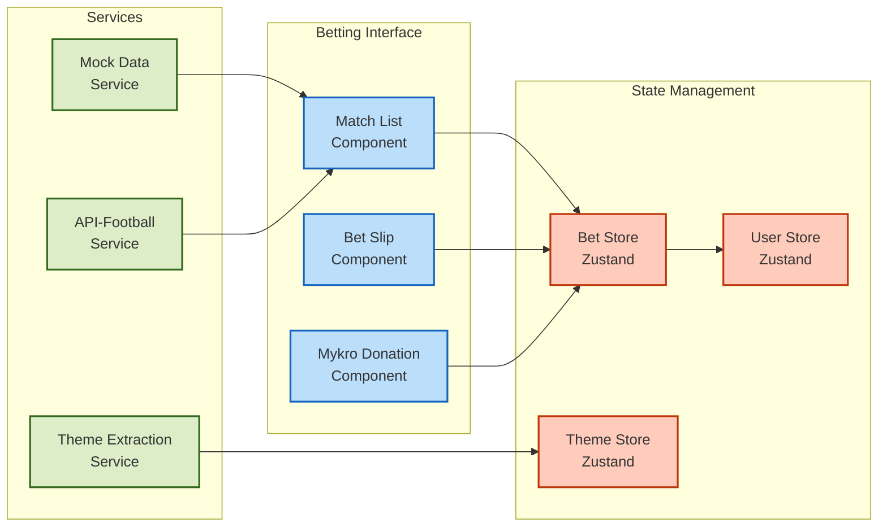
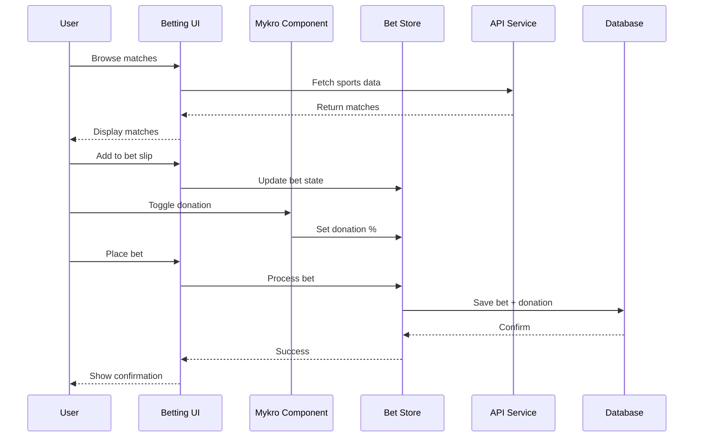
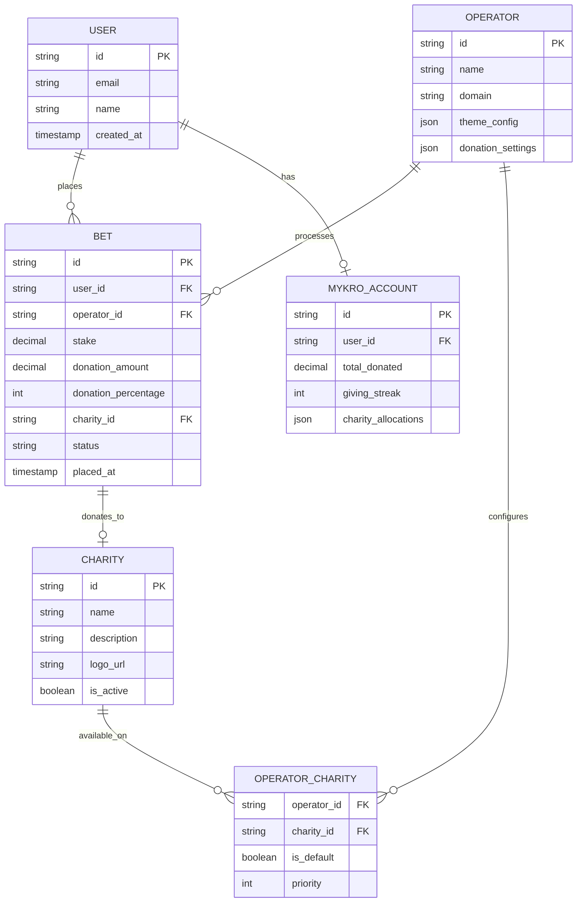

# Mykro Ecosystem Process Diagram

## User Flow & System Architecture

## Component Interaction Diagram

## Data Flow Sequence

## Logical Data Model

## Key Business Rules

1. **Donation Calculation**: 
   - Minimum: 1% of stake
   - Maximum: 10% of stake
   - Default: 5% (configurable per operator)

2. **Charity Selection**:
   - Operators curate available charities
   - Users select from operator's list
   - Default charity if none selected

3. **Theme Extraction**:
   - Analyzes competitor URL
   - Extracts primary colors, fonts
   - Applies to white-label interface

4. **Impact Tracking**:
   - Aggregates donations across operators
   - Maintains giving streaks
   - Shows cumulative impact

## Technology Stack

- **Frontend**: React 18 + TypeScript + Vite
- **State**: Zustand with persistence
- **Styling**: Tailwind CSS
- **Routing**: React Router v6
- **Data**: localStorage (dev) / Supabase (prod)
- **APIs**: API-Football for sports data